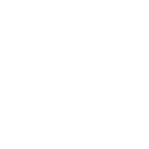

<!-- Rxyhn's Aesthetic GitHub Profile -->

<!-- Profile -->

<strong><samp>❀❀❀❀❀⟰❀❀❀❀❀</samp></strong>

  <samp>
      
     
     
    <b>
      Hello there.
     
      I'm Yuni Hutsuka. Nice to meet you.
    </b>
  </samp>

<strong><samp>❀❀❀❀❀⟱❀❀❀❀❀</samp></strong>

 

<samp><b>More Info</b></samp>

<h2></h2> 

<!-- Contact Me -->

  <samp>
    [<a href="https://twitter.com/yuni_hutsuka">twitter</a>]
    [<a href="https://www.pixiv.net/users/20509498">pixiv</a>]
    [<a href="https://kakuyomu.jp/users/yuni_hutsuka">kakuyomu</a>]
    [<a href="mailto:yuni.wille999@gmail.com">e-mail</a>]
  </samp>

<h2></h2> 

<!-- Github Stats -->

  <table>
    <tr>
      <td>
        
      </td>
      <td>
        
      </td>
    </tr>
  </table>

---

# 自己紹介

## プロフィール

| 項目         | 詳細                                                 |
|--------------|------------------------------------------------------|
| 名前（PN）   | 二日ゆに                                             |
| 性別         | 男                                                   |
| 趣味         | 剣道・キャッチボール・小説執筆・ハーモニカ           |
| 好きな作品   | 数えきれないのでいつか遍歴を晒すサイトを作る         |
| 原点かつ原典 | 宇宙戦艦ヤマト・銀河鉄道999・新世紀エヴァンゲリオン  |

## やっていること

主に小説執筆。

おまけ程度の個人開発。

あんまり真面目じゃない。

## 内部リンク

- [作品視聴遍歴はこちら](./detail/history.md)
- [よくやっているゲームなど](./detail/games.md)
- [現在抱えてるタスク](./detail/task.md)
